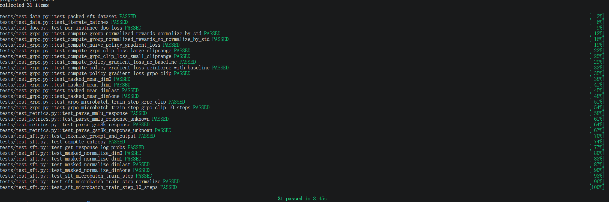
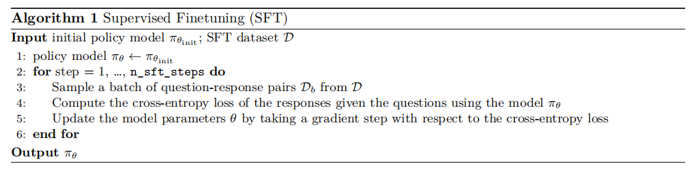
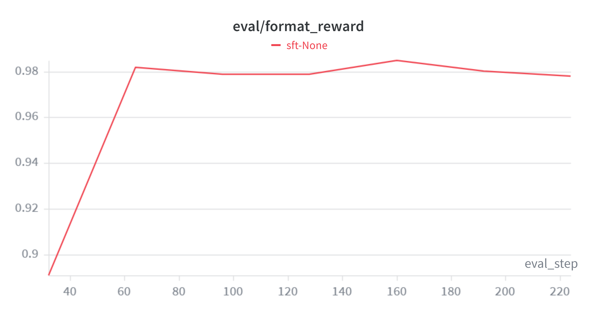
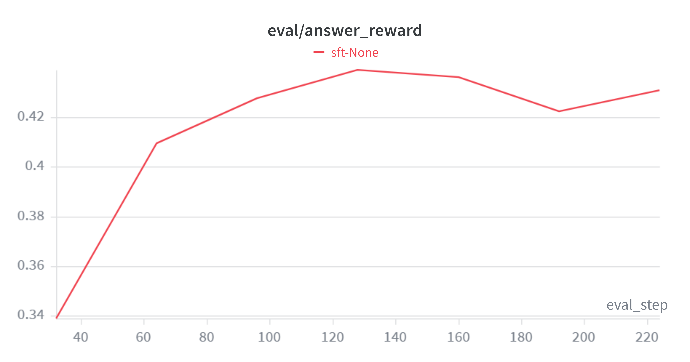
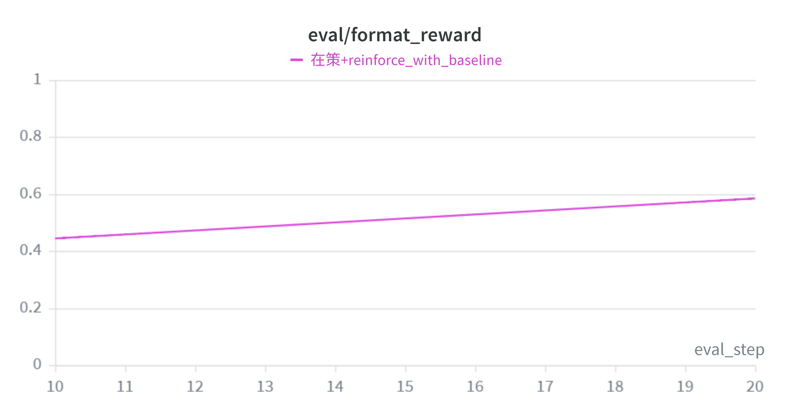
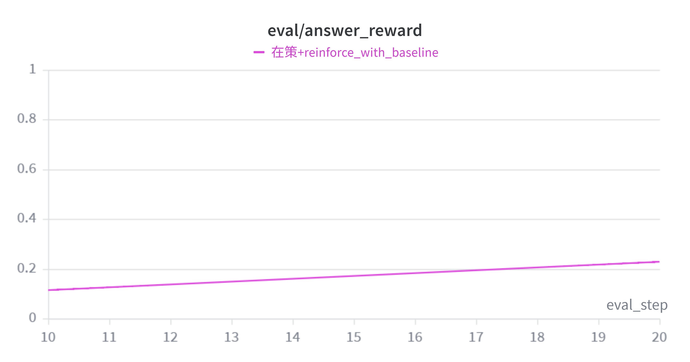
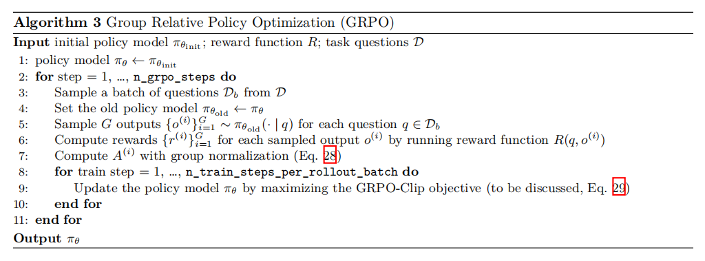
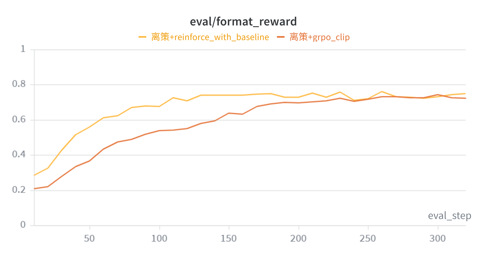
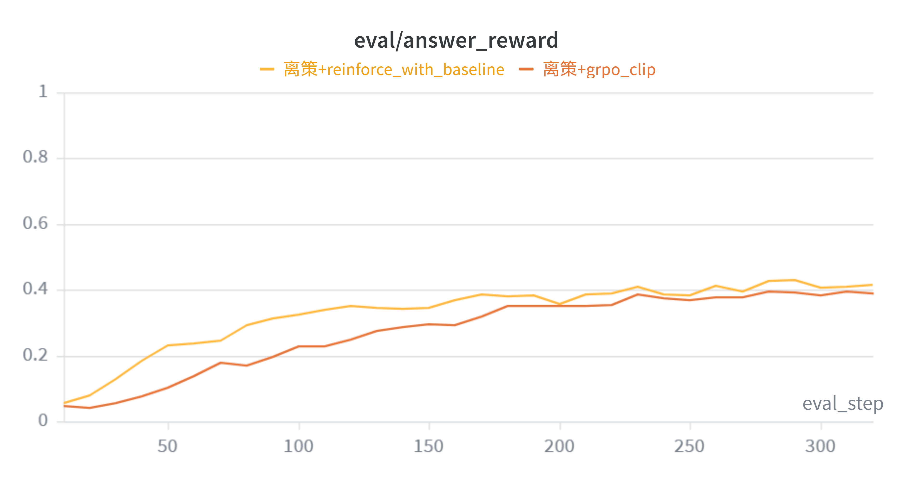

# CS336 Assignment 5 学习报告

## **Alignment and Reasoning RL**

## **Instruction Tuning and RLHF**

在本实验中，我完成了作业5以及其补充作业的完整测试环节，下面将对作业5部分进行详细的介绍。


<div align="center">
  
  <br>
  <em>图 1：测试结果</em>
</div>


## 1. 在 GSM8K 上测试零样本性能（未经过微调）

在开始微调之前，为了与微调后的结果进行对比，我首先进行了零样本性能测试。由于无法使用 Together cluster 的数据集 MATH，我们选用了 GSM8K 数据集来评估模型的零样本性能。GSM8K 包含 8000 个小学数学问题，广泛用于衡量语言模型在数学推理方面的能力。

本次零样本性能测试主要采用 DeepSeek R1-Zero 模型的提示词，以期在短时间内显著提升准确率（尽管作业五指出仅通过问题本身对模型进行初始提示即可获得极高准确率，但实际可能仅表现为推理速度变慢）。同时，我依据作业要求，使用 vLLM 作为基线，并选取了模型 `Qwen/Qwen2.5-Math-1.5B` 进行测试。


> **评估结果统计如下：**
> * 总数据量: 1319
> * (1) Format 1.0 且 Answer 1.0 (双对): 26
> * (2) Format 1.0 且 Answer 0.0 (格式对，答案错): 228
> * (3) Format 0.0 且 Answer 0.0 (双错): 1065
> * (4) Format 0.0 且 Answer 1.0 (格式错，答案对): 0

**关于 Format=0.0 且 Answer=0.0 的分析:**
观察抽样的 10 个 Format=0 案例，可以得出结论：**问题主要出在基础模型的输出上**，而非解析器过于严苛。具体表现为基础模型未能稳定遵循结构化输出指令，出现了幻觉，自顾自产生对话，经常忘记使用 `<answer>` 标签等行为。

**关于 Format=1.0 且 Answer=0.0 的分析:**
分析 Format=1 且 Answer=0 的情形，发现**问题是由模型的计算错误和解析器的提取缺陷共同造成的**，因为在部分情况模型确实未能得出正确答案；在部分情况模型实际上得出了完全正确的数值结果，但是，模型在 `<answer>` 标签内包含了自然语言补充说明或特殊符号（例如 `<answer> Jackson is 4 years old.</answer>` 或 `<answer> Bentley paid $11,050. </answer>`）。当前的解析器显然无法处理标签内的冗余文本，导致本该得分的正确答案被判为 0 分。


> **零样本测试最终得分：**
> * **格式正确率 (Format)**：**0.1926**
> * **结果正确率 (Answer)**：**0.0197**

---

## 2. 监督微调（SFT）

在正式实现 SFT 之前，先要编写一些辅助方法。

### 2.1 辅助方法

* **辅助方法 1：分词与掩码处理函数**
  编写一个处理提示词（prompt）和输出（output）的函数。该函数接收提示词和输出字符串，利用分词器处理后返回一个字典，包含三个字段：
  1. `input_ids`: 合并后的提示词和输出分词序列（截断最后一个 token）。
  2. `labels`: 对应的目标标签序列（去掉第一个 token）。
  3. `response_mask`: 针对 `labels` 中响应部分的掩码（仅对 `<answer>` 部分标记为 1）。
  *(注：在 `test/conftest.py` 的第 213 行，需将模型 ID 修改为 `Qwen/Qwen2.5-Math-1.5B`。)*

* **辅助方法 2：Token 熵计算函数**
  编写一个函数，用于计算模型在预测下一个 token 时的信息熵。输入为模型的 logits（形状为 `[batch_size, seq_len, vocab_size]`），输出为每个位置预测分布的熵（形状为 `[batch_size, seq_len]`）。
  实现过程：先对 logits 在词表维度应用 $\log\text{sumexp}$ 运算，得到 $\log\sum_{j} e^{\text{logits}_j}$，进而计算对数概率：
  $$\log p_i = \text{logits}_i - \log\sum_{j}e^{\text{logits}_j}$$
  这等价于 $\log\text{softmax}(\text{logits})$。随后通过 softmax 得到概率分布 $p_i$，计算各位置的熵并对词表维度求和：
  $$H = -\sum_{i}p_i\cdot\log p_i$$

* **辅助方法 3：对数概率提取函数**
  该函数接收辅助方法 1 生成的 `input_ids` 和 `labels`、HuggingFace 模型以及一个布尔值（是否返回熵）。
  通过模型前向传播获取 logits $f_\theta(\text{input\_ids})$，进而计算：
  $$\log[\text{softmax}(f_\theta(\text{input\_ids}))]$$
  根据 `labels` 提取对应 token 的对数概率值，即 $\log p_\theta(y|x) = \log[\text{softmax}(f_\theta(\text{input\_ids}))]_y$。若布尔值为真，则同时调用辅助方法 2 返回每个 token 的熵。

* **辅助方法 4：掩码归一化函数**
  接收一个张量、同形状的掩码、归一化除数及维度，返回归一化后的张量。实现时通过 `tensor * mask` 后调用 `torch.sum` 进行求和，确保仅计算掩码标记为 1 的有效元素。


在实现下一个辅助方法之前，我们先介绍一下 **梯度累积技术**：梯度累积的基本思想是，我们不在每个批次之后立即更新模型权重（即不立刻执行优化器步骤），而是在执行梯度更新步骤之前，将多个批次的梯度累积起来。其原因在于：受限于硬件显存，这种技术允许我们在训练中变相使用更大的有效批次大小。

在具体实现过程中，我们只需每 $k$ 步才调用一次 `optimizer.step()` 和 `optimizer.zero_grad()`，其中 $k$ 是梯度累积的步数。为了确保梯度在这些累积步骤中被正确地取平均，在调用 `loss.backward()` 之前，我们需要将损失除以 `gradient_accumulation_steps`。

```python
gradient_accumulation_steps = 4

for idx, (inputs, labels) in enumerate(data_loader):
    # 前向传播
    logits = model(inputs)
    loss = loss_fn(logits, labels) / gradient_accumulation_steps
    
    # 反向传播
    loss.backward()
    
    if (idx + 1) % gradient_accumulation_steps == 0:
        # 每隔gradient_accumulation_steps个批次更新一次权重
        optimizer.step()
        # 每隔gradient_accumulation_steps个批次清零一次梯度
        optimizer.zero_grad()
```

在多分类问题中，交叉熵损失的数学定义是真实分布 $p$ 和模型预测分布 $q$ 之间的差异：
$$L_{CE}=-\sum_{i=1}^{|\mathcal{V}|}p(i)\log q(i)$$

在监督微调（SFT）中，我们的训练数据是确定的下一个真实单词（由于是监督学习）。这意味着真实分布 $p$ 是一个 One-Hot 向量，对于词表里其他所有的 token，概率 $p(\text{others})=0$，所以公式写成：
$$L_{CE}=-1\cdot\log q(\text{target})=-\log p_\theta(x_t|x_{<t})$$

由此，就能得到计算损失的辅助方法。

* **辅助方法5：SFT 单微批次训练步骤**  输入一个对数概率张量以及该张量对应的掩码，梯度累计的步数，一个用于除求和结果的常数（在掩码归一化中用到），具体实现为在词序列维度调用掩码归一化函数（辅助方法4）得到负对数似然，对 batch 取平均后再除梯度累计的步数得到 loss，并将其记录。

### 2.2 SFT 主要过程

先通过 DeepSeek R1 的提示将模型每一条训练数据中包含的一个 prompt 和一个对应的 response 学习输出类似 `<think> reasoning process here </think> <answer> answer here </answer>` 的格式，将提示后的数据输入分词器（辅助方法1）得到拼接在一起的分词后的问题和答案，进而得到 inputs 和 labels 以及 labels 对应的掩码，将 inputs 放入 `Qwen/Qwen2.5-Math-1.5B` 模型得到输出 logits，通过 logits 得到词汇维度的对数概率并取 labels 相应的概率得到对应的对数概率（辅助方法3），并计算下一个 token 对应的熵（辅助方法2），用对数概率进一步算出掩码归一化后的交叉熵损失，并进行反向传播（辅助方法4，辅助方法5），梯度更新的过程考虑梯度累计技巧，并在训练过程中进行记录（辅助方法6），得到微调后的模型。

<div align="center">
  
  <br>
  <em>图 2：SFT主要过程</em>
</div>


在本次实验中，我投入了大量时间进行环境配置。最初发现 `pyproject.toml` 中指定的 `vllm` 与 `transformers==4.50.0` 存在兼容性问题。最终确定的可运行环境配置为：`transformers==4.51.3`、`vllm==0.7.2`、`PyTorch 2.5.1`、`Python 3.12` 以及 `CUDA 12.4`。由于实验所需显存较大，且 CUDA 尚未支持 RTX 5090，我选择在两块 `vGPU-48GB-350W` 上运行。

在使用 GSM8K 数据集时需特别注意：该数据集与 MATH 数据集的格式存在部分不一致，且包含少量乱码。因此在分词处理时，应按照以下方式确保准确性：
```python
prompt_token = tokenizer.encode(prompt, add_special_tokens=False)
output_token = tokenizer.encode(output, add_special_tokens=False)
```

训练过程中的格式设置也至关重要（需严格遵循 `cs336_5/cs336_alignment/drgrpo_grader.py` 中的规范），否则即便多一个换行符也会导致评估错误。正确的响应格式示例如下：
```python
response = f"\n{reasoning}\n</think> <answer> {final_answer} </answer>"
```


若训练设置不当，模型既无法学习到正确的输出格式，也无法获得正确答案。此时的格式奖励与答案奖励与零样本性能（即未经过 SFT 的基线）相差无几。

<div align="center">
  
  <br>
  <em>图 3：格式奖励（正确设置）</em>
</div>

然而在正确配置下，SFT 的监督学习效果显著提升。随着监督学习样本量的增加，格式奖励稳定在 0.98 附近，答案奖励则稳定在 0.43 左右，相较于题目要求的 15% 已有显著超越。尽管本次实验使用的是相对简单的 GSM8K 数据集，但相比于零样本推理时仅约 2% 的准确率，经过 SFT 后 43% 的准确率无疑是一个巨大的提升。

<div align="center">
  
  <br>
  <em>图 4：答案奖励（正确设置）</em>
</div>


---

## 3. Group Relative Policy Optimization (GRPO)

### 3.1 大语言模型中的策略梯度算法

在传统强化学习中，策略梯度法是一种直接优化策略的算法，其核心思想是将策略参数化为 $\pi_{\theta}(a|s)=p(A=a|S=s,\theta)$，通过优化参数 $\theta$ 来提升策略 $\pi_\theta$ 的性能。

在大语言模型中，当前状态 $s_t$ 对应已生成的文本前缀，当前动作 $a_t$ 则为下一个预测的词元。策略 $\pi_\theta(\cdot|s_t)$ 表示在给定前缀下下一个词元的概率分布：
$$a_t\sim\pi_\theta(\cdot\mid s_t),\quad\pi_\theta(a_t\mid s_t)=\text{softmax}(f_\theta(s_t))=\frac{\exp(z_t^{(a_t)})}{\sum_{j\in\mathcal{V}}\exp(z_t^{(j)})}$$

其中 $\mathcal{V}$ 为词表，$z_t^{(j)}$ 为模型输出的第 $j$ 个 logit。

一个完整的轨迹可表示为：
$$\tau=(s_0,a_0,s_1,a_1,\ldots,s_T,a_T)$$

其中初始状态 $s_0$ 为输入提示词，服从分布 $s_0\sim\rho(s_0)$，而 $\rho(s_0)$ 是基于格式化提示词的分布。在大语言模型中，环境可视为确定性过程：下一个状态 $s_{t+1}$ 由当前状态与所选动作拼接而成，即 $s_{t+1}=s_t\|a_t$。

在数学推理等可验证任务中，通常采用稀疏奖励设置：仅有终止动作对应的最终结果可获得验证后的奖励，即 $r_t=0$ 对于 $t<T$，而 $r_T$ 根据答案正确性赋予奖励值。

回报 $R(\tau)$ 聚合了轨迹上的所有奖励，可表示为总奖励和或带折扣因子的累积奖励。优化目标为最大化期望回报：
$$J(\theta)=\mathbb{E}_{\tau\sim\pi_{\theta}}[R(\tau)]$$

策略梯度法的损失函数为：
$$L(\theta)=-\frac{1}{N}\sum_{i=1}^{N}\sum_{t=0}^{T}\log\pi_\theta(a_t^{(i)}|s_t^{(i)})R(\tau^{(i)})$$

带有基准的策略梯度损失函数为：
$$L(\theta)=-\frac{1}{N}\sum_{i=1}^{N}\sum_{t=0}^{T}\log\pi_\theta(a_t^{(i)}|s_t^{(i)})\left(R(\tau^{(i)})-b(s_t^{(i)})\right)$$

其中基准仅依赖于当前状态。在作业 5 中，已详细证明带有基准的策略梯度损失函数的梯度与策略梯度法的损失函数的梯度相等，因此可以用带有基准的策略梯度损失函数代替策略梯度法的损失函数。

### 3.2 GRPO 的核心机制

**组相对策略优化 (GRPO)** 引入了一种高效的**优势估计 (Advantage Estimation)** 机制：针对同一个问题，从当前策略 $\pi_\theta$ 中采样多条输出轨迹构成一个“组”，并利用该组的内部统计量作为基准来计算优势。

具体而言，GRPO 将传统方法中的 $R(\tau^{(i)}) - b(s_t^{(i)})$ 定义为优势 $A_t^{(i)}$，其形式为组内标准化的奖励：
$$A_t^{(i)} = A^{(i)} = \frac{r^{(i)} - \operatorname{mean}(r^{(1)},r^{(2)},\dots,r^{(G)})}{\operatorname{std}(r^{(1)},r^{(2)},\dots,r^{(G)})+\epsilon}$$

在此设定下，基准可近似视为组内奖励均值：$b(s_t) \approx \operatorname{mean}(r^{(1)},\dots,r^{(G)})$。由于该基准以及分母的缩放因子与当前具体动作 $a_t$ 无关，这种变换在不改变梯度方向的前提下对梯度进行了有效缩放。

**信用分配假设：**
在数学推理中，很难界定究竟是第 1 个 token 还是第 50 个 token 促成了最终的正确答案。因此，GRPO 采用简化的信用分配策略：如果整句得分高于组内平均水平（即 $A^{(i)} > 0$），则该轨迹上的所有动作 $a_t$ 都应受到正向激励。即对于第 $i$ 条轨迹上的所有时间步 $t$：
$$A_t^{(i)} = A^{(i)}$$

此时，单个 token 的策略梯度损失函数（采用梯度下降策略求解，因此加负号）为：
$$J(\theta) = -A_t\cdot\log p_\theta(o_t|q,o_{<t})$$

**重要性采样与 PPO 裁剪：**
由于语言模型在单步更新时策略通常不会发生巨变，而朴素策略梯度法（在策方法，On-Policy）每更新一步都需要重新推理采样大量轨迹，这极其低效。为此，我们引入概率论中的重要性采样思想：
$$\mathbb{E}_{x\sim P}[f(x)] = \mathbb{E}_{x\sim Q}\left[\frac{P(x)}{Q(x)}f(x)\right]$$

由此得到离策（Off-Policy）下的策略梯度损失：
$$J(\theta) = -A_t\cdot\frac{\pi_\theta(o_t|q,o_{<t})}{\pi_{\theta_{old}}(o_t|q,o_{<t})}$$

进一步结合近端策略优化（PPO）中的裁剪机制，限制策略更新幅度 $\epsilon$，得到 per-token 的 **GRPO-Clip 损失**：
$$L_t^{CLIP} = -\min\left(\frac{\pi_\theta(o_t|q,o_{<t})}{\pi_{\theta_{old}}(o_t|q,o_{<t})}A_t,\text{clip}\left(\frac{\pi_\theta(o_t|q,o_{<t})}{\pi_{\theta_{old}}(o_t|q,o_{<t})},1-\epsilon,1+\epsilon\right)A_t\right)$$


### 3.3 GRPO 训练循环的实现与实验结果对比

在实验的最后阶段，我实现了完整的 GRPO 训练循环。基准配置如下：总迭代 20 步，学习率 $1\times 10^{-5}$，防除零常数 $\epsilon=1\times 10^{-6}$。

**在策实验（On-Policy）：**
配置为每个批次仅更新 1 轮。每组采样数为 8，训练 Batch Size 为 256，梯度累积步数为 128（微批次大小为 2）。损失函数使用 `reinforce_with_baseline`，优势直接采用归一化后的组奖励。

<div align="center">
  
  <br>
  <em>图 5：在策情况下格式奖励随训练样本增加的变化</em>
</div>

<div align="center">
  
  <br>
  <em>图 6：在策情况下答案奖励随训练样本增加的变化</em>
</div>

在此配置下，经过 20 步迭代，仅消耗了 640 个训练样本，模型在 1319 个验证集上就达到了 58% 的格式正确率和 23% 的答案正确率，展现了 RL 优化的初步威力。

<div align="center">
  
  <br>
  <em>图 7：GRPO 算法流程与更新机制示意图</em>
</div>

**离策实验（Off-Policy）与不同损失函数对比：**
为了验证离策优化的效率，我将参数调整为：每个采样批次重复更新 4 轮，Batch Size 缩减为 64，梯度累积步数调整为 32。为保证多轮更新的稳定性，引入 `grpo_clip`（裁剪范围 0.2）。同时，设置了 `reinforce_with_baseline` 在同等离策参数下的对比实验。

<div align="center">
  
  <br>
  <em>图 8：离策情况下格式奖励对比图</em>
</div>

<div align="center">
  
  <br>
  <em>图 9：离策情况下答案奖励对比图</em>
</div>

**实验结论：**
如图 8、9 所示，无论是 `reinforce_with_baseline` 还是 `grpo_clip`，在 20 步迭代（仅消耗 640 个新样本）后，均能达到 75% 以上的格式正确率与 40% 左右的答案正确率。这一表现已经与使用 7000 多条全量样本进行 SFT 的效果相当，充分证明了离策强化学习对样本利用的高效性。

对比两种损失函数可以发现，`reinforce_with_baseline` 在训练初期准确率提升更为迅猛。我认为这是因为它缺少梯度裁剪机制，初期的大步长更新带来了更快的收敛。不过由于本次实验的总迭代步数较少，并未完全展现出 `grpo_clip` 在长期训练中维持模型稳定性、防止策略崩溃的核心优势。